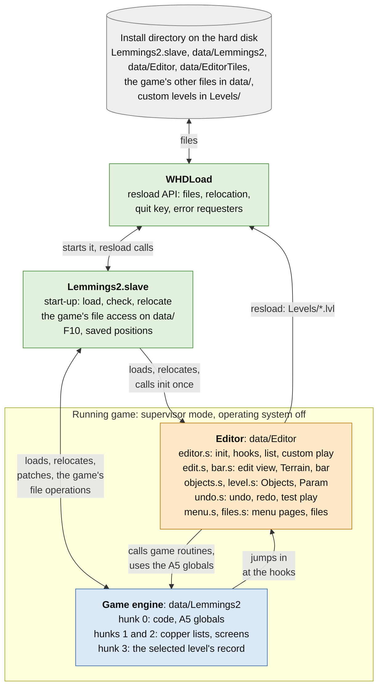
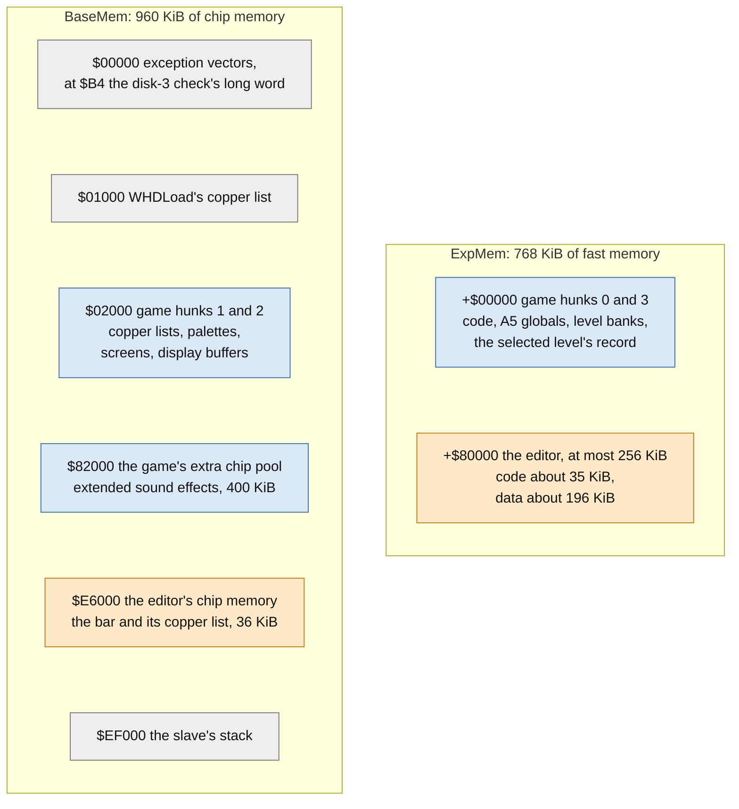
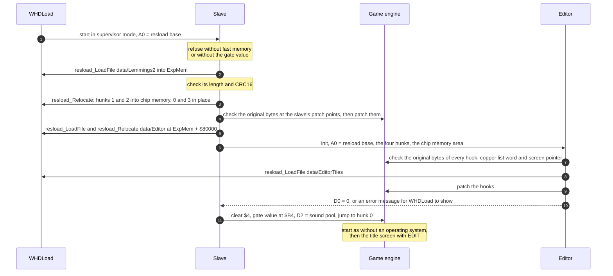
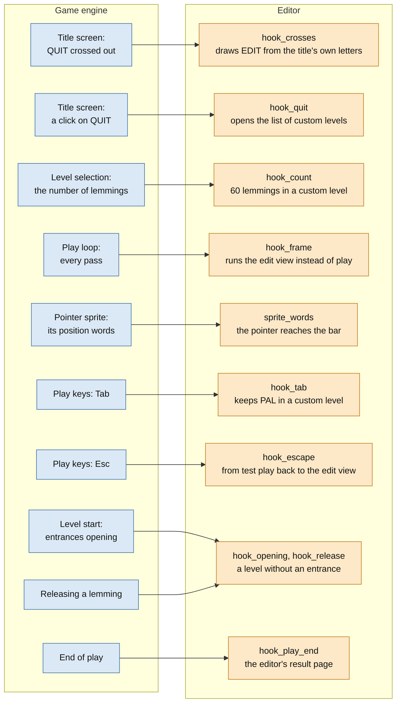
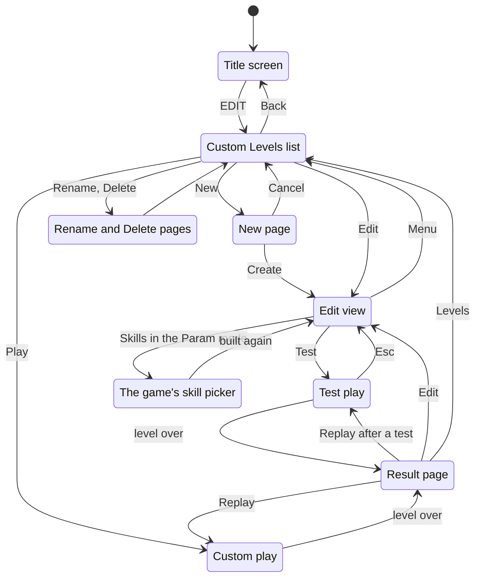
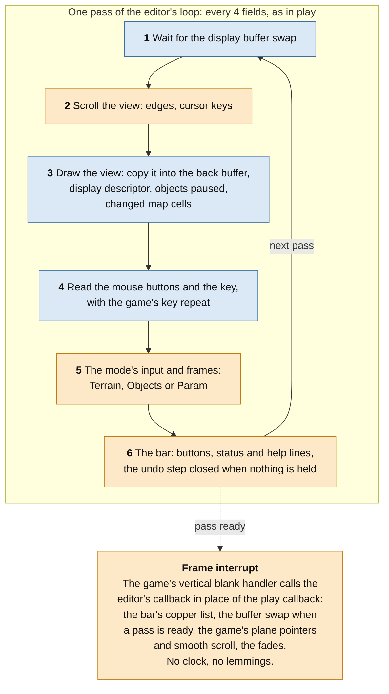
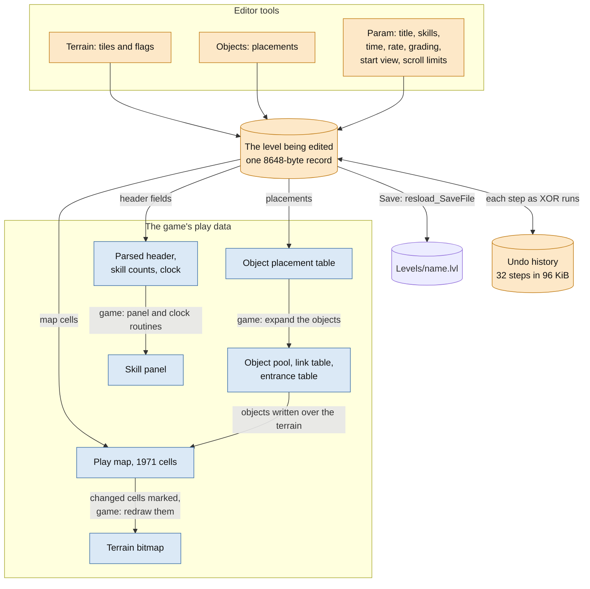
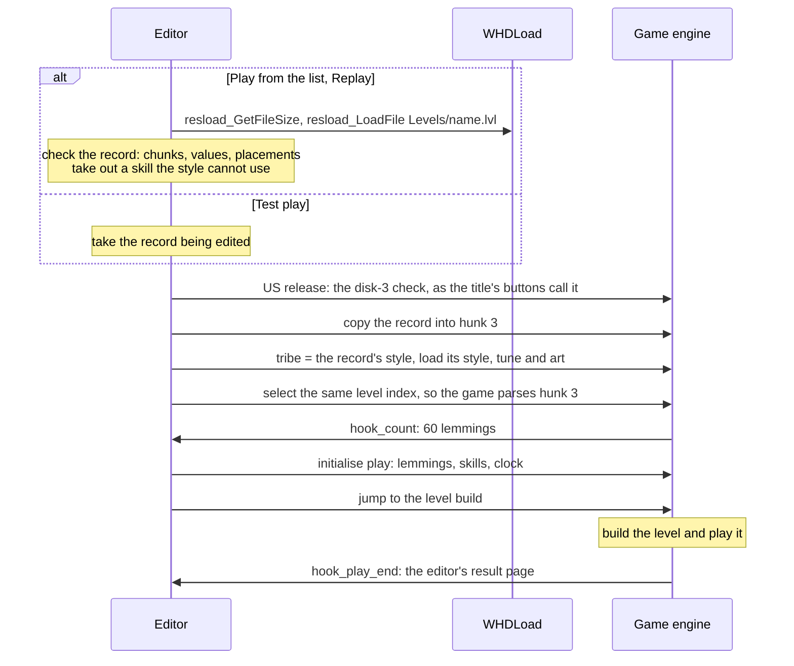

# Lemmings 2: The Tribes level editor: architecture

08.10.2026 Timo Heimonen (timo.heimonen@proton.me)

This document describes how the in-game level editor for Amiga Lemmings 2:
The Tribes is built into the game: what runs where, how the editor gets
into the game engine, and how editing, playing and saving a level use the
game's own code. It is written for readers of the sources
(`src/whdload/`, `src/editor/`); the [user's guide](manual.md) describes
the editor from the player's side.

Offsets in the game are hexadecimal and relative to the start of a hunk
of the unpacked main program `data/Lemmings2`, hunk 0 unless another hunk
is named. The two supported releases, the US release (SPS 1976) and the
PAL release (SPS 0351), have their code at different offsets; the tables
give both, and `src/whdload/release.i` with the `GAME` lines in the sources
holds them all. A5 points to the game's global variables, which the
editor reads and writes at the same offsets as the game.

## The idea in short

The editor is not a separate program. It is a module that the WHDLoad
slave loads next to the unmodified game, and it runs inside the game: the
game's own code builds, draws and plays every level, and the editor adds
its screens and its tools at a small set of hooks.

- **The level is the game's own record.** A `.lvl` file is the 8648-byte
  level record the game keeps for its own levels (an IFF-style `FORM` of
  type `L2LV`, [the format](editor-lvl-format.md)). The editor keeps one
  record as the level being edited and makes everything the game shows
  again from it. There is no second format and no conversion.
- **The game's code does the work.** Building the map and the objects,
  drawing the terrain, the objects' graphics, the skill panel, the clock,
  the menu screen and its text, the skill picker and the whole of play
  are the game's routines, which the editor calls with the game's own
  registers and globals.
- **Few patch points, each one checked.** The slave changes 6 places in
  the game for the start from hard disk, the editor 10 places for its
  hooks; a few more are changed only while they are needed. Every
  patched instruction is checked against its original bytes first, and
  another version of the game is refused.
- **The game's own state is kept.** The editor never writes the tribes'
  progress or the saved positions, and it puts the selected tribe, its
  level and the record in hunk 3 back when its session ends.

## Components

| Part | Source | Role |
| --- | --- | --- |
| WHDLoad | | Runs the slave with the operating system off, loads and saves files on its behalf (resload) and quits with F10 or on an error. |
| Slave | `src/whdload/slave.s` | Loads and relocates the game and the editor, starts the game as its own floppy loader does on an expanded machine, and replaces the game's floppy access with WHDLoad's file access. |
| Game engine | `data/Lemmings2` (the user's own) | Unchanged on the disk; in memory only its patch points change. It still runs every level, the title, the menus and play. |
| Editor | `src/editor/*.s`, assembled into `data/Editor` | Adds EDIT to the title screen, the list of custom levels, the edit view with its bar, test play and the result page. It works through the game's routines and its own copy of the level record. |
| `data/EditorTiles` | made by the install tool | The usual Decor and Steel flags of each style's tiles, counted from the game's own levels, so that a brush starts with the flags those tiles usually have. |

## Memory

The install needs fast memory: hunks 0 and 3 of the game and the editor
run from it, and the chip memory they leave free holds the game's extra
pool for its extended sound effects and the editor's bar, as the game's
own loader arranges it on an expanded machine. WHDLoad gives the slave
two areas:

Most of the editor's data is the undo history (96 KiB of steps), the
names of the files in `Levels` (16 KiB), and a few whole records: the
level being edited, the level as last saved, the state undo starts from,
the list's read buffer and the game's own record kept aside during the
editor's session. With 1 MiB of fast memory WHDLoad puts the 768 KiB
ExpMem in chip memory, which the slave refuses, so the install needs at
least 2 MiB of fast memory.

## Start-up

The slave starts the game as the game's own disk loader does when there
is no operating system: `$4` (ExecBase) is cleared, so that every check
the game makes for an operating system takes its own hardware path, and
D0 to D2 carry the loader's memory values (D2 the extra chip pool; no file
cache area, since WHDLoad's `PRELOAD` keeps the files in memory). The
game's disk-3 check reads a long word at `$B4`; the slave's source holds
zero there (`gate_value`), and the install tool copies the value from the
user's own main program into the slave, which refuses to start without it.

## Hooks into the game engine

The editor runs only when the game jumps to it. Each hook replaces a few
instructions with a jump to the editor; when the editor has nothing to do
there (the game's own levels, Practice, the title without EDIT clicked),
the hook does the replaced instructions and goes on where the game would,
so the game plays as before.

The editor's permanent hooks, patched once at init:

| Hook | US | PAL | Where in the game | What the editor does |
| --- | --- | --- | --- | --- |
| `hook_crosses` | `$0D8E4` | `$0D672` | The title screen draws the crosses over QUIT | Draws EDIT over the button, composed from the letters of the title's own labels, and goes on after the crosses |
| `hook_quit` | `$0DAE8` | `$0D746` | The title's click test for the QUIT column | Fades the title out, starts the editor's session and opens the list (in the PAL release, whose QUIT column only returns to the title, `hook_quit_column` first tests the column) |
| `hook_count` | `$019D4` | `$019CC` | Level selection takes the number of lemmings | 60 for a custom level (the game's number for a level without progress), else the game's own |
| `hook_frame` | `$00146` | `$0013E` | The play loop's first calls on every pass | When a level was opened for editing, enters the edit view and stays in it; else the game's own calls |
| `sprite_words` | `$014EC` | `$014CC` | The pointer sprite's position words | Also sets the high bit of the first and last line, which the game leaves out, so that the pointer reaches the bar below line 255 |
| `hook_tab` | `$00BAE` | `$00BA6` | Tab in play switches between PAL and NTSC | Ignored while a custom level plays: the bar needs PAL lines |
| `hook_escape` | `$00BD8` | `$00BD0` | Esc in play starts the level again | In test play, goes back to the edit view with the editor's state as before the test |
| `hook_opening` | `$001EA` | `$001E2` | The entrances open at the level's start | With no entrance, the opening ends at once (the game's loop over the entrances assumes at least one) |
| `hook_release` | `$09AD6` | `$0986E` | A lemming is released | With no entrance, none is |
| `hook_play_end` | `$00336` | `$0032E` | Play ends | A custom level goes to the editor's result page; Practice and the tribes' levels go on as in the game, so the tribes' progress is only ever written by the game's own levels |

Patched only while they are needed:

| Place | US | PAL | Changed while | Change |
| --- | --- | --- | --- | --- |
| Play copper list: the display window | hunk 1 `$00100` | the same | the edit view is shown | The window ends at line `$124` instead of `$F4`, below the skill panel |
| Play copper list: its end | hunk 1 `$001C4` | the same | the edit view is shown | `COPJMP2` to the bar's copper list in the editor's chip memory; the editor sets `COP2LC` every field |
| The frame callback | A5 + `$222` | A5 + `$220` | the edit view is shown | The editor's interrupt routine in place of the play callback |
| The skill picker's frame wait | `$1619C` | `$15ED0` | the picker runs | Esc or the right button leave it, keeping the old skills |
| The picker's end | `$161B6` | `$15EEA` | the picker runs | Returns after the eighth choice instead of going on to Practice |
| The picker's prompt | `$16478` | `$161AC` | the picker runs | The editor's prompt |
| The picker's icon, choice and name | `$16444`, `$16358`, `$163FA` | `$16178`, `$1608C`, `$1612E` | the picker runs | In a Classic-style level the Blocker in the Attractor's place, as only Classic levels can use the Blocker and only the others the Attractor |

The slave's patches, for the start from hard disk:

| Patch | US | PAL | Game code | Replacement |
| --- | --- | --- | --- | --- |
| Disk selection | `$11796` | `$11500` | Looks for the requested disk in the drives | Keeps only what the game sets once the disk is found: all files are in `data/` |
| File operation | `$11B98` | `$118F0` | The game's own OFS file system code | Reads and writes through `resload_GetFileSize`, `resload_LoadFile` and `resload_SaveFile` on `data/`; a missing file gives the game's own "object not found" |
| Keyboard | `$00E2E` | `$00E1E` | The keyboard interrupt stores the key | The same, then F10 quits |
| Saved positions | `$16A64` | `$16782` | LOAD and SAVE ask for the saved position disk | Reads the file at once, after the menu's colours |
| Disk 3 message | `$16BB4` | `$16894` | "Looking for Disk 3" after LOAD and SAVE | Not shown |
| Display calibration | `$0E550` | | The US release's PAL clock value runs the clock too fast | The PAL value of the game's own Tab handler |
| Disk-3 track reader | | `$01B66` | The PAL release reads disk 3 at the first title | Returns at once: there is no floppy drive, and the value it would leave at `$B4` is there already |

## Screens and control flow

The list, the New, Rename and Delete pages and the result page are drawn
on the game's own menu screen (the one LOAD, SAVE and the game's results
use) with the game's routines for the background, the colour fades, the
text and the pointer; the editor draws its buttons in the look of the
game's red buttons. Custom play, test play and the edit view use the
game's play view.

When the list is first opened from the title, the editor keeps the
selected tribe, its level index and the record in hunk 3 aside. A custom
level is played as one of the selected tribe's levels, so these change;
when the list returns to the title they are put back and the game reloads
the tribe's style if it differs. The game's title and its own PLAY, MAP
and PRACTICE then work as before.

## The edit view

Opening a level for editing opens it as for play: the record goes into
hunk 3 and the game builds the level. The play loop's first pass then
reaches `hook_frame`, and the editor takes over:

1. It puts its own routine in the game's frame callback, which the game's
   vertical blank interrupt calls, makes the play copper list jump to the
   bar's copper list, lets the pointer reach the bar and fades the play
   colours and the bar in.
2. It makes the objects again from the record (the level build has
   already moved their animations a frame on).
3. Its loop replaces the play loop. Each pass calls the same game
   routines the play loop calls for the display, but releases no lemmings
   and does not run the clock; the objects are drawn with the game's pause
   flag set, so that they keep their first frame and nothing but the
   editor writes the play map.

Blue steps are the game's routines, orange ones the editor's.

### From the record to the screen

Every tool changes only the record being edited. What the game shows is
then made again from the record by the game's own code, so the view is
always what the level will be in play:

- **Map and objects** (`objects_apply`): the record's 64 placements are
  copied, byte-swapped, into the game's placement table, the play map is
  replaced by the record's cells, and the game's own routines clear the
  map's border and expand the objects (the object pool, the link table,
  the entrance table, switches and teleporters, exactly as at a level's
  start). Every cell that changed is marked, and the game's own redraw
  draws it into the terrain bitmap on the next pass.
- **Parameters**: a field is changed in the record, in the game's parsed
  header and in the play counts and clock together, and the game's panel
  routines draw the panel again.
- **The skill picker** is the game's own Practice picker, with the
  temporary patches above. It draws over the play display, so afterwards
  the edit view is built again through the same path that opened it, with
  the editor's mode, view, selections and unsaved changes kept.
- **Undo and redo** keep each step as the XOR of the record before and
  after it, in runs of long words, and make the view again from the
  record after every step.
- **Saving** writes the record to its file with `resload_SaveFile`.

## Playing a custom level

Play from the list, Replay on the result page and test play from the edit
view all enter a level through the same path (`enter_level`):

The game selects a level by copying it from its tribe's level bank into
hunk 3 and parsing it there; when the index is the one already selected,
it parses hunk 3 again without copying. The editor uses that: it writes
the record into hunk 3 and selects the current index, so the game's own
parser, level build and play run on the custom level unchanged. (The PAL
release checks the disk-3 value inside the level selection itself.)

The level is started the way Practice starts its levels, in the
record's own style, with the record's skills, clock, release rate and
grading. At the
end the editor's result page shows the saved lemmings and the grade by
the game's rule; the game's own result screen, which writes the tribes'
progress, is never reached. Test play plays a copy, so the record being
edited, the undo history and the editor's state are unchanged when Esc or
the result page's Edit returns to the edit view.

## Files

| What | How |
| --- | --- |
| The game's files (styles, music, sounds, saved positions) | The game's own loader and its OFS code, redirected by the slave to `resload_LoadFile` and `resload_SaveFile` on `data/` |
| The list of custom levels | `resload_ListFiles` on `Levels`: up to 512 `.lvl` names, sorted; a page's files are read when the page is shown |
| Opening and playing a level | `resload_GetFileSize`, then `resload_LoadFile`; a file that is not one valid record, or holds values the game cannot take, is listed as damaged and is never played or opened |
| Saving, New | `resload_SaveFile` |
| Delete | `resload_DeleteFile`, then `resload_GetFileSize` to confirm |
| Rename | WHDLoad cannot rename: the file is loaded, saved under the new name, checked and the old one deleted |

The install's icon gives WHDLoad `NOWRITECACHE`, so that a saved, renamed
or deleted level is on the disk when the editor says so. WHDLoad turns
the operating system on for each write, with the display blank, and the
editor clears the game's key state afterwards, since the key that saved
is released while WHDLoad has the keyboard.

## Two releases from one source

The US release (SPS 1976) and the PAL release (SPS 0351) differ only in
the main program: hunks 1 to 3 are the same, while hunk 0 has its code at
other offsets, some A5 globals two bytes lower and a few differences that
matter here:

- The US release has paths for the game's own hard-disk installation and
  crosses QUIT out only without an operating system; the PAL release always
  crosses it out, and its QUIT column only returns to the title.
- The US release checks disk 3 in one routine before PLAY, MAP and
  PRACTICE; the PAL release reads disk 3 once, at the first title, and
  compares the value when a level is selected and before Practice.
- The US release's display calibration leaves a clock value that runs
  the game's clock too fast on a PAL display, which the slave corrects.

`src/whdload/release.i` defines the `GAME` macro, which gives each offset
for both releases; the slave and the editor are assembled once for each
release (with `PAL_RELEASE` for the PAL one), and the install tool
installs the pair that matches the user's disks.
